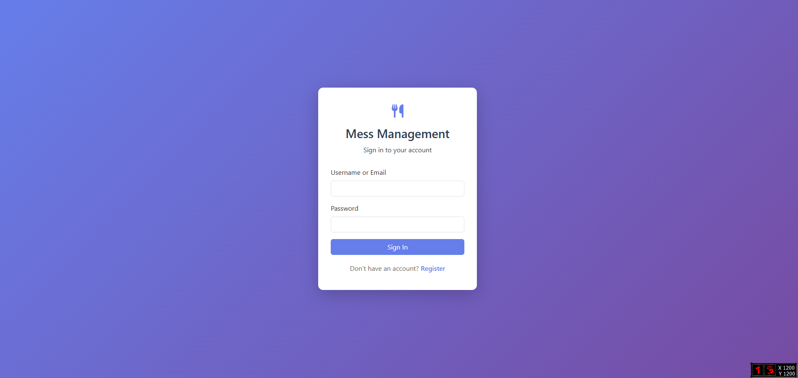
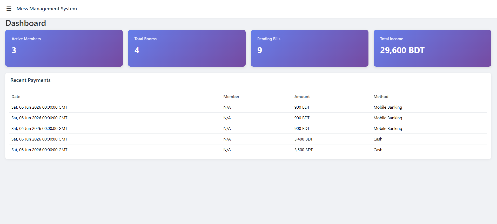
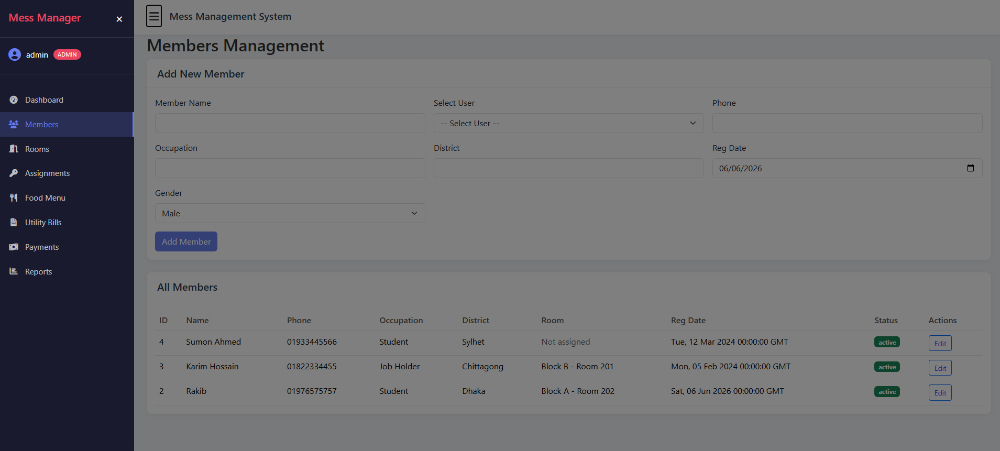
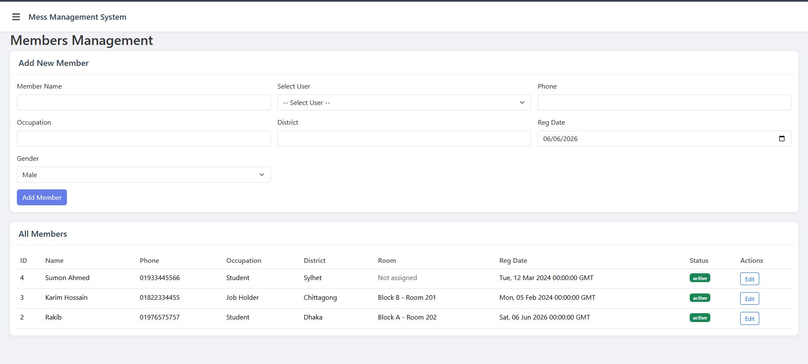
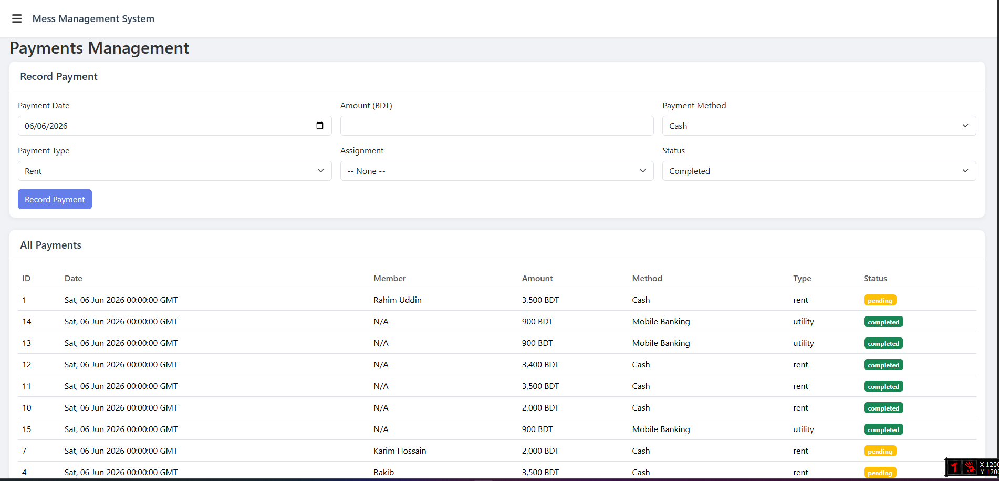
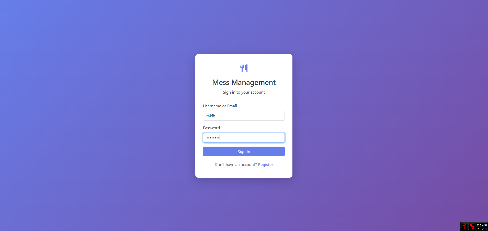
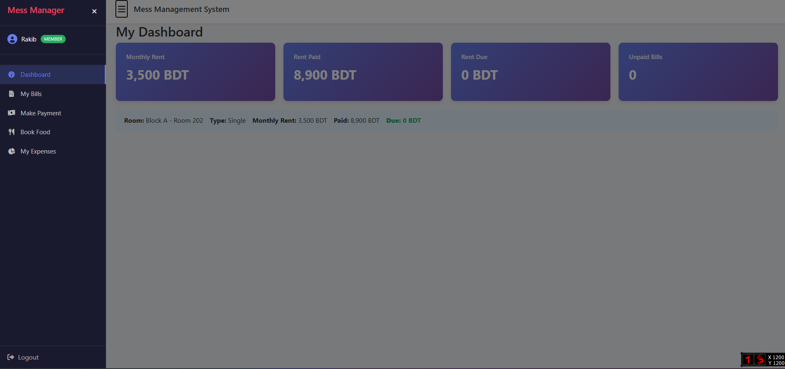
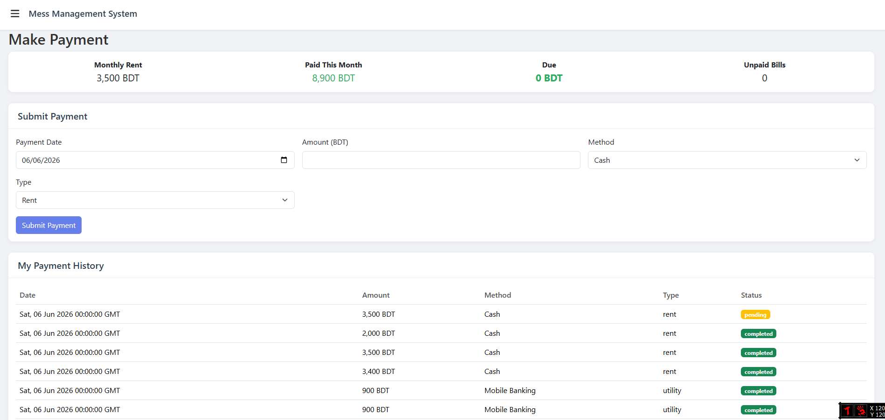
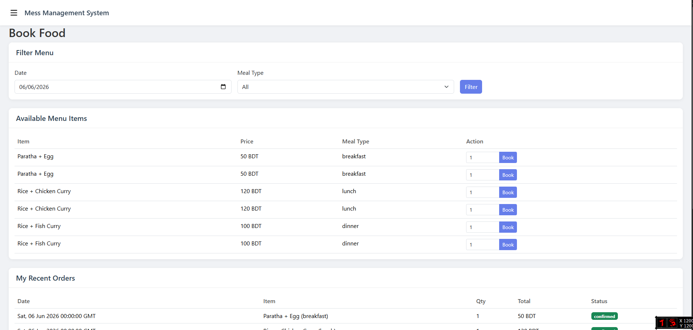
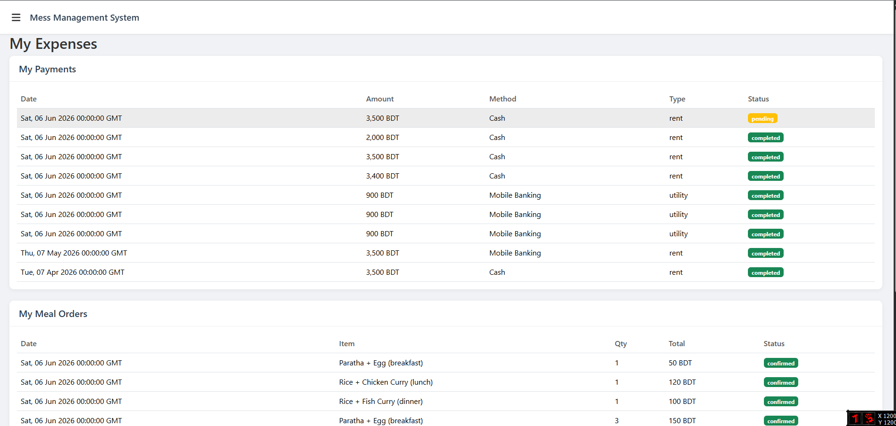

# 🏠 Mess Management System

<div align="center">


**A modern web-based hostel & mess management system built with Flask, MySQL, and Bootstrap.**

Manage rooms, members, rent, food bookings, utility bills, and payments from a single platform.

</div>

---

## 📸 Screenshots

### 🔐 Login



### 👨‍💼 Admin Panel









### 👤 Member Panel











## ✨ Features

### 👨‍💼 Admin Panel

* 📊 Dashboard with overall statistics
* 👥 Member management
* 🏠 Room & room type management
* 🛏️ Room assignment tracking
* 💰 Rent management
* 🍛 Daily food menu management
* ⚡ Utility bill generation & tracking
* 💳 Payment monitoring
* 📈 Reports & analytics
* 📤 Data export support

### 👨‍🎓 Member Panel

* 📋 Personal dashboard
* 💰 Rent summary & dues
* ⚡ Utility bill tracking
* 💳 Online payment submission
* 🍽️ Food booking system
* 📜 Expense history
* 📊 Payment records

---

## 🛠️ Tech Stack

| Layer              | Technology                 |
| ------------------ | -------------------------- |
| Backend            | Python Flask 3.0           |
| Database           | MySQL / MariaDB            |
| Frontend           | HTML5, CSS3, Bootstrap 5.3 |
| JavaScript         | Vanilla JS                 |
| Authentication     | Werkzeug Password Hashing  |
| Session Management | Flask Sessions             |

---

## 📂 Project Structure

```bash
mess_system_new/
│
├── app.py
├── config.py
├── db.py
├── requirements.txt
├── schema.sql
│
├── static/
│   ├── css/
│   │   └── style.css
│   └── js/
│       ├── admin.js
│       └── member.js
│
├── templates/
│   ├── base.html
│   ├── login.html
│   ├── register.html
│   │
│   ├── admin/
│   │   ├── dashboard.html
│   │   ├── members.html
│   │   ├── rooms.html
│   │   ├── assignments.html
│   │   ├── food_menu.html
│   │   ├── utility_bills.html
│   │   ├── payments.html
│   │   └── reports.html
│   │
│   └── member/
│       ├── dashboard.html
│       ├── bills.html
│       ├── payments.html
│       ├── food_booking.html
│       └── expenses.html
│
├── README.md
├── LICENSE
└── .gitignore
```

---

## 🚀 Installation

### 1️⃣ Clone Repository

```bash
git clone <repo-url>
cd mess_management_system
```

---

### 2️⃣ Create Database

```sql
CREATE DATABASE IF NOT EXISTS mess_management_new;
```

Import schema:

```bash
mysql -u root -p mess_management_new < schema.sql
```

💡 The application can also automatically create the database and required tables on first launch.

---

### 3️⃣ Install Dependencies

```bash
pip install -r requirements.txt
```

---

### 4️⃣ Configure Database

Edit `config.py`

```python
DB_HOST = 'localhost'
DB_USER = 'root'
DB_PASS = ''
DB_NAME = 'mess_management_new'
```

---

### 5️⃣ Run Application

```bash
python app.py
```

Application will start at:

```text
http://localhost:5000
```

---

## 🔐 Default Login Credentials

| Role         | Username | Password  |
| ------------ | -------- | --------- |
| 👨‍💼 Admin  | admin    | admin123  |
| 👨‍🎓 Member | rahim    | member123 |
| 👨‍🎓 Member | karim    | member123 |
| 👨‍🎓 Member | sumon    | member123 |

> ⚠️ Default users are automatically created during first startup.

---

## 🌱 Sample Data

After logging in, visit:

| Endpoint                    | Purpose                                                   |
| --------------------------- | --------------------------------------------------------- |
| `/api/seed-data`            | Creates rooms, room types, and assignments                |
| `/api/seed-historical-data` | Creates historical bills, food menu, orders, and payments |

---

## 📡 API Endpoints

<details>
<summary>🔑 Authentication APIs</summary>

| Method | Endpoint    |
| ------ | ----------- |
| GET    | `/login`    |
| POST   | `/login`    |
| GET    | `/register` |
| POST   | `/register` |
| GET    | `/logout`   |

</details>

<details>
<summary>👨‍💼 Admin APIs</summary>

* Dashboard
* Members
* Rooms
* Room Types
* Assignments
* Food Menu
* Utility Bills
* Payments
* Reports

</details>

<details>
<summary>👨‍🎓 Member APIs</summary>

* Dashboard
* Bills
* Payments
* Food Menu
* Food Orders
* Expense History

</details>

---

## 📸 Screenshots

Add screenshots here:

```md


```

---

## 🎯 Key Functionalities

✅ Room Allocation

✅ Rent Tracking

✅ Utility Bill Management

✅ Food Booking

✅ Payment Management

✅ Expense Monitoring

✅ Historical Reports

✅ Member Dashboard

---

## 🔒 Security Features

* Password Hashing using Werkzeug
* Session-based Authentication
* Role-based Access Control
* Input Validation
* Secure Database Queries

---

## 🤝 Contributing

Contributions are welcome!

1. Fork the repository
2. Create a feature branch
3. Commit your changes
4. Push to your branch
5. Open a Pull Request

---

## 📜 License

This project is licensed under the **MIT License**.

---

## 👨‍💻 Author

**Nirjon**

Developed as part of a Hostel/Mess Management System project.

⭐ If you found this project helpful, consider giving it a star!
